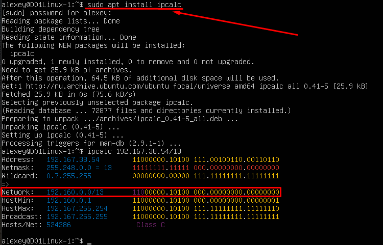
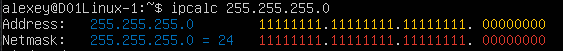
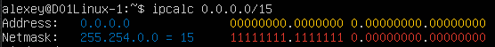
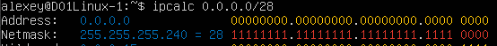

## Part 1. Инструмент **ipcalc**
1. Сети и маски
    1. Адрес сети 192.167.38.54/13

        - `Установка ipcalc - sudo apt install ipcalc`
        - `Получаем информацию о сетевом адресе ipcalc 192.167.38.54/13`

        

    2. Перевод маски *255.255.255.0* в префиксную и двоичную запись, */15* в обычную и двоичную, *11111111.11111111.11111111.11110000* в обычную и префиксную

        - `Перевод маски *255.255.255.0* в префиксную и двоичную запись - ipcalc 255.255.255.0`

        `255.255.255.0 - В префиксной - 24`
        `255.255.255.0 - В двоичной 11111111.11111111.11111111.00000000`

        

        - `/15 в обычную и двоичную - ipcalc 0.0.0.0/15`

        `/15 - В обычной 255.254.0.0`
        `/15 - В двоичной 11111111.11111110.00000000.00000000`

        

        - `11111111.11111111.11111111.11110000 в обычную и префиксную`

        `ipcalc 0.0.0.0/28 - По кол-ву 1`
        `В обычной 255.255.255.240`
        `В префиксной - 28`

        

    3. Минимальный и максимальный хост в сети *12.167.38.4* при масках: */8*, *11111111.11111111.00000000.00000000*, *255.255.254.0* и */4*