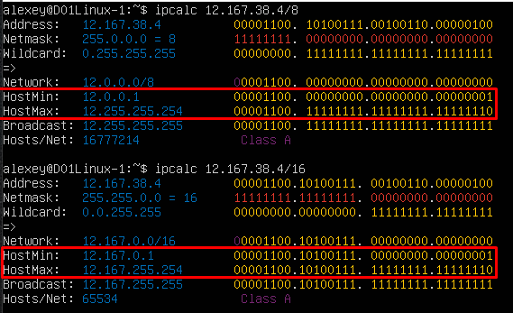
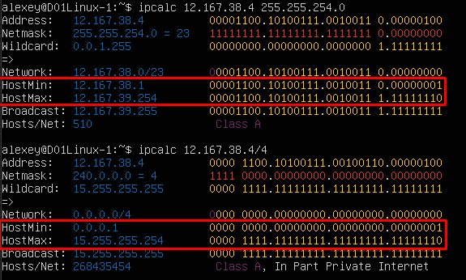

## Part 1. Инструмент **ipcalc**
1. Сети и маски
    1. Адрес сети 192.167.38.54/13

        - `Установка ipcalc - sudo apt install ipcalc`
        - `Получаем информацию о сетевом адресе ipcalc 192.167.38.54/13`

        

    2. Перевод маски *255.255.255.0* в префиксную и двоичную запись, */15* в обычную и двоичную, *11111111.11111111.11111111.11110000* в обычную и префиксную

        - `Перевод маски *255.255.255.0* в префиксную и двоичную запись - ipcalc 255.255.255.0`

        `В префиксной - 24`
        `В двоичной 11111111.11111111.11111111.00000000`

        

        - `/15 в обычную и двоичную - ipcalc 0.0.0.0/15`

        `В обычной 255.254.0.0`
        `В двоичной 11111111.11111110.00000000.00000000`

        

        - `11111111.11111111.11111111.11110000 в обычную и префиксную`

        `В обычной 255.255.255.240`
        `В префиксной - 28`

        

    3. Минимальный и максимальный хост в сети *12.167.38.4* при масках: */8*, *11111111.11111111.00000000.00000000*, *255.255.254.0* и */4*

        - `/8, 11111111.11111111.00000000.00000000`

        

        - `255.255.254.0 и /4`

        

2. localhost
    1. Определить и записать в отчёт, можно ли обратиться к приложению, работающему на localhost, со следующими IP: *194.34.23.100*, *127.0.0.2*, *127.1.0.1*, *128.0.0.1*

    - 194.34.23.100 (нельзя)
    - 127.0.0.2 (можно -> Loopback)
    - 127.1.0.1 (можно -> Loopback)
    - 128.0.0.1 (нельзя)

3. Диапазоны и сегменты сетей
    1. какие из перечисленных IP можно использовать в качестве публичного, а какие только в качестве частных: *10.0.0.45*, *134.43.0.2*, *192.168.4.2*, *172.20.250.4*, *172.0.2.1*, *192.172.0.1*, *172.68.0.2*, *172.16.255.255*, *10.10.10.10*, *192.169.168.1*

    2. какие из перечисленных IP адресов шлюза возможны у сети *10.10.0.0/18*: *10.0.0.1*, *10.10.0.2*, *10.10.10.10*, *10.10.100.1*, *10.10.1.255*