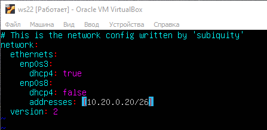
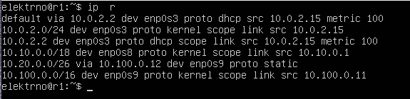
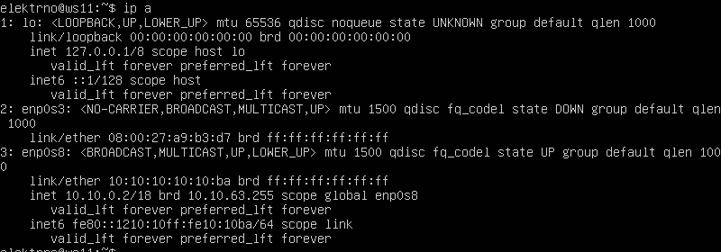

## Part 1. Инструмент **ipcalc**
1. Сети и маски
    1. Адрес сети 192.167.38.54/13

        - `Установка ipcalc - sudo apt install ipcalc`
        - `Получаем информацию о сетевом адресе ipcalc 192.167.38.54/13`

        

    2. Перевод маски *255.255.255.0* в префиксную и двоичную запись, */15* в обычную и двоичную, *11111111.11111111.11111111.11110000* в обычную и префиксную

        - `Перевод маски *255.255.255.0* в префиксную и двоичную запись - ipcalc 255.255.255.0`

        `В префиксной - 24`
        `В двоичной 11111111.11111111.11111111.00000000`

        

        - `/15 в обычную и двоичную - ipcalc 0.0.0.0/15`

        `В обычной 255.254.0.0`
        `В двоичной 11111111.11111110.00000000.00000000`

        

        - `11111111.11111111.11111111.11110000 в обычную и префиксную`

        `В обычной 255.255.255.240`
        `В префиксной - 28`

        


    3. Минимальный и максимальный хост в сети *12.167.38.4* при масках: */8*, *11111111.11111111.00000000.00000000*, *255.255.254.0* и */4*

        - `/8, 11111111.11111111.00000000.00000000`

        

        - `255.255.254.0 и /4`

        

2. localhost
    1. Определить и записать в отчёт, можно ли обратиться к приложению, работающему на localhost, со следующими IP: *194.34.23.100*, *127.0.0.2*, *127.1.0.1*, *128.0.0.1*

        - 194.34.23.100 (нельзя)
        - 127.0.0.2 (можно -> Loopback)
        - 127.1.0.1 (можно -> Loopback)
        - 128.0.0.1 (нельзя)


3. Диапазоны и сегменты сетей
    1. какие из перечисленных IP можно использовать в качестве публичного, а какие только в качестве частных: *10.0.0.45*, *134.43.0.2*, *192.168.4.2*, *172.20.250.4*, *172.0.2.1*, *192.172.0.1*, *172.68.0.2*, *172.16.255.255*, *10.10.10.10*, *192.169.168.1*

        - Публичные: `134.43.0.2` `192.172.0.1` `172.68.0.2` `192.169.168.1` `172.0.2.1`
        - Частные: `10.0.0.45` `192.168.4.2` `172.20.250.4` `172.16.255.255` `10.10.10.10` 

    2. какие из перечисленных IP адресов шлюза возможны у сети *10.10.0.0/18*: *10.0.0.1*, *10.10.0.2*, *10.10.10.10*, *10.10.100.1*, *10.10.1.255*

        - Возможные: `10.10.0.2` `10.10.10.10` `10.10.1.255`

## Part 2. Статическая маршрутизация между двумя машинами

##### Поднять две виртуальные машины (далее -- ws1 и ws2)

##### С помощью команды `ip a` посмотреть существующие сетевые интерфейсы


##### Описать сетевой интерфейс, соответствующий внутренней сети, на обеих машинах и задать следующие адреса и маски: ws1 - *192.168.100.10*, маска */16*, ws2 - *172.24.116.8*, маска */12*

1. lo или local loopback (локальная петля) - это виртуальный сетевой интерфейс, который используется для обратной связи с вашим собственным компьютером. Он обычно имеет IP-адрес 127.0.0.1 и позволяет вам обращаться к приложениям и сервисам, работающим на вашем собственном компьютере, через сетевые протоколы, такие как HTTP или TCP/IP. Local loopback используется для тестирования и отладки приложений, а также для доступа к локальным ресурсам без необходимости подключения к внешней сети.

2. enp0s3 - это название сетевого интерфейса в Linux. Конфигурация enp0s3 включает в себя IP-адрес, маску подсети, шлюз по умолчанию и другие параметры сети, которые определяют, как ваш компьютер связывается с другими устройствами в сети.


##### Выполнить команду `netplan apply` для перезапуска сервиса сети


#### 2.1. Добавление статического маршрута вручную
1. Добавить статический маршрут от одной машины до другой и обратно при помощи команды вида `ip r add`

- `ws1 -> sudo ip r add 172.24.116.8 dev enp0s3`
- `ws2 -> sudo ip r add 192.168.100.10 dev enp0s3`

2. Пропинговать соединение между машинами

- `ws1 -> ping 172.24.116.8`


- `ws2 -> ping 192.168.100.10`


#### 2.2. Добавление статического маршрута с сохранением
##### Перезапустить машины

- `reboot`

##### Добавить статический маршрут от одной машины до другой с помощью файла *etc/netplan/00-installer-config.yaml*

- `ws1/ws2 -> sudo vim /etc/netplan/00-installer-config.yam`


##### Пропинговать соединение между машинами

- `ws1/ws2 -> sudo netplan apply`
- `ws1 -> ping 172.24.116.8`
- `ws2 -> ping 192.168.100.10`


## Part 3. Утилита **iperf3**
#### 3.1. Скорость соединения

8 Mbps = 1 MB/s
100 MB/s = 819200 Kbps
1 Gbps = 1024 Mbps

#### 3.2. Утилита **iperf3**

- `ws1/ws2 -> sudo apt install iperf3`

##### Измерить скорость соединения между ws1 и ws2

- `ws1 -> режим сервера -> iperf3 -s`
- `ws2 -> ping на сервер ws1 -> iperf3 -c 192.168.100.10` 


## Part 4. Сетевой экран

#### 4.1. Утилита **iptables**

- `ws1/ws2 -> cd /etc`
- `ws1/ws2 -> sudo touch firewall.sh`
- `ws1/ws2 -> sudo vim firewall.sh`


-A добавляет правило   
-p указывает протокол (tcp/icmp)    
--dport порт назначения  
--icmp-type указание типа  
-j переход к цепочке  


  
  
  
  

- `Разница между стратегиями: в утилите iptables правила выполняются  сверху вниз. В ws1 первым указано запрещающее правило на выход, поэтому не сможет пропинговать другую ws2. У ws2 машины, наоброт первым указано разрешающее правило, значит сможет пропинговать ws1.`

#### 4.2. Утилита **nmap**

- `Не пингуется с ws1`  


- `ДАМП`  


## Part 5. Статическая маршрутизация сети


#### 5.1. Настройка адресов машин

  
  
  
  
  

- `Перезапуск сети на каждой машине -> sudo netplan apply`  
- `Используем команду ip -4 a`  

  
  
  
  
 

Также пропинговать ws22 с ws21.  


Аналогично пропинговать r1 с ws11.  


#### 5.2. Включение переадресации IP-адресов.

##### Для включения переадресации IP, выполните команду на роутерах:
`sysctl -w net.ipv4.ip_forward=1`

  


##### Откройте файл */etc/sysctl.conf* и добавьте в него следующую строку:
`net.ipv4.ip_forward = 1`

  


#### 5.3. Установка маршрута по-умолчанию

##### Настроить маршрут по-умолчанию (шлюз) для рабочих станций. Для этого добавить gateway4 \[ip роутера\] в файле конфигураций

- `ws11 -> 10.10.0.1`  
- `ws21/ws22 -> 10.20.0.1`  


  
  


##### Вызвать `ip r` и показать, что добавился маршрут в таблицу маршрутизации

- `Использование команды ip r`


  
  


##### Пропинговать с ws11 роутер r2 и показать на r2, что пинг доходит. Для этого использовать команду:
`tcpdump -tn -i eth1`

- `r2 -> sudo tcpdump -tn -i enp0s8`  
- `ws11 -> ping -c 4 10.100.0.12`  


- `Дописал gateway4 для r1 10.100.0.12 для r2 10.100.0.11`


#### 5.4. Добавление статических маршрутов

##### Добавить в роутеры r1 и r2 статические маршруты в файле конфигураций. 


##### Вызвать `ip r` и показать таблицы с маршрутами на обоих роутерах.




##### Запустить команды на ws11:
`ip r list 10.10.0.0/[маска сети]` и `ip r list 0.0.0.0/0`


`Для адреса 10.10.0.0/18 был выбран маршрут, отличный от 0.0.0.0/0, потому что он является явным адресом сети и доступен без шлюза.`

#### 5.5. Построение списка маршрутизаторов

##### Запустить на r1 команду дампа:
`tcpdump -tnv -i eth0`


##### При помощи утилиты **traceroute** построить список маршрутизаторов на пути от ws11 до ws21


Принцип работы **traceroute** основан на отправке пакетов данных с изменяющимся значением TTL (Time to Live) в IP-заголовке. TTL представляет собой счетчик, который определяет максимальное количество промежуточных узлов (роутеров), которые пакет может пройти до его удаления. Каждый промежуточный узел, через который проходит пакет, уменьшает значение TTL на 1. Когда пакет достигает узла с TTL равным нулю, узел отвечает ICMP-сообщением "Time Exceeded" (превышение времени). Это позволяет определить IP-адрес и время ответа каждого промежуточного узла на пути к целевому хосту. **Traceroute** отправляет несколько пакетов данных с постепенно увеличивающимся значением TTL. Это позволяет определить последовательность промежуточных узлов и время, затраченное на достижение каждого узла. В результате **traceroute** строит список IP-адресов и временных задержек для каждого узла на пути к целевому хосту. 

#### 5.6. Использование протокола **ICMP** при маршрутизации

##### Запустить на r1 перехват сетевого трафика, проходящего через eth0 с помощью команды:
`tcpdump -n -i eth0 icmp`


##### Пропинговать с ws11 несуществующий IP (например, *10.30.0.111*) с помощью команды:
`ping -c 1 10.30.0.111`


##### Сохранить дампы образов виртуальных машин


## Part 6. Динамическая настройка IP с помощью **DHCP**

##### Для r2 настроить в файле */etc/dhcp/dhcpd.conf* конфигурацию службы **DHCP**:

-> `sudo apt-get update`
-> `sudo apt-get install isc-dhcp-server -y`
-> `sudo vim /etc/dhcp/dhcpd.conf`

##### 1) указать адрес маршрутизатора по-умолчанию, DNS-сервер и адрес внутренней сети. Пример файла для r2:

```shell
subnet 10.100.0.0 netmask 255.255.0.0 {}

subnet 10.20.0.0 netmask 255.255.255.192
{
    range 10.20.0.2 10.20.0.50;
    option routers 10.20.0.1;
    option domain-name-servers 10.20.0.1;
}
```


##### 2) в файле *resolv.conf* прописать `nameserver 8.8.8.8.`

-> `sudo vim /etc/resolv.conf`


##### Перезагрузить службу **DHCP** командой `systemctl restart isc-dhcp-server`. Машину ws21 перезагрузить при помощи `reboot` и через `ip a` показать, что она получила адрес. Также пропинговать ws22 с ws21.


##### Указать MAC адрес у ws11, для этого в *etc/netplan/00-installer-config.yaml* надо добавить строки: `macaddress: 10:10:10:10:10:BA`, `dhcp4: true`


##### Для r1 настроить аналогично r2, но сделать выдачу адресов с жесткой привязкой к MAC-адресу (ws11). Провести аналогичные тесты

-> `sudo apt-get update`
-> `sudo apt-get install isc-dhcp-server -y`
-> `sudo vim /etc/dhcp/dhcpd.conf`


-> `reboot \\ws11`



##### Запросить с ws21 обновление ip адреса


-> `sudo dhclient -r enp0s8`  
- Команда "sudo dhclient -r enp0s8" используется для освобождения IP-адреса, полученного через DHCP на интерфейсе enp0s8. Это может быть полезно, если вы хотите освободить адрес и получить новый адрес от DHCP-сервера.

-> `sudo dhclient enp0s8`  
- Команда "sudo dhclient enp0s8" используется для запуска DHCP-клиента на интерфейсе enp0s8. DHCP-клиент будет пытаться получить IP-адрес, маску подсети, шлюз по умолчанию и другие сетевые настройки от DHCP-сервера, подключенного к этому интерфейсу.

