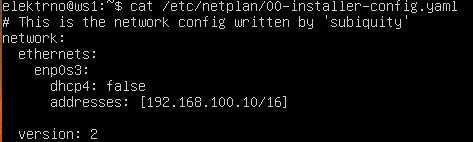
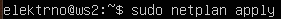

## Part 1. Инструмент **ipcalc**
1. Сети и маски
    1. Адрес сети 192.167.38.54/13

        - `Установка ipcalc - sudo apt install ipcalc`
        - `Получаем информацию о сетевом адресе ipcalc 192.167.38.54/13`

        

    2. Перевод маски *255.255.255.0* в префиксную и двоичную запись, */15* в обычную и двоичную, *11111111.11111111.11111111.11110000* в обычную и префиксную

        - `Перевод маски *255.255.255.0* в префиксную и двоичную запись - ipcalc 255.255.255.0`

        `В префиксной - 24`
        `В двоичной 11111111.11111111.11111111.00000000`

        

        - `/15 в обычную и двоичную - ipcalc 0.0.0.0/15`

        `В обычной 255.254.0.0`
        `В двоичной 11111111.11111110.00000000.00000000`

        

        - `11111111.11111111.11111111.11110000 в обычную и префиксную`

        `В обычной 255.255.255.240`
        `В префиксной - 28`

        

    3. Минимальный и максимальный хост в сети *12.167.38.4* при масках: */8*, *11111111.11111111.00000000.00000000*, *255.255.254.0* и */4*

        - `/8, 11111111.11111111.00000000.00000000`

        

        - `255.255.254.0 и /4`

        

2. localhost
    1. Определить и записать в отчёт, можно ли обратиться к приложению, работающему на localhost, со следующими IP: *194.34.23.100*, *127.0.0.2*, *127.1.0.1*, *128.0.0.1*

        - 194.34.23.100 (нельзя)
        - 127.0.0.2 (можно -> Loopback)
        - 127.1.0.1 (можно -> Loopback)
        - 128.0.0.1 (нельзя)

3. Диапазоны и сегменты сетей
    1. какие из перечисленных IP можно использовать в качестве публичного, а какие только в качестве частных: *10.0.0.45*, *134.43.0.2*, *192.168.4.2*, *172.20.250.4*, *172.0.2.1*, *192.172.0.1*, *172.68.0.2*, *172.16.255.255*, *10.10.10.10*, *192.169.168.1*

        - Публичные: `134.43.0.2` `192.172.0.1` `172.68.0.2` `192.169.168.1` `172.0.2.1`
        - Частные: `10.0.0.45` `192.168.4.2` `172.20.250.4` `172.16.255.255` `10.10.10.10` 

    2. какие из перечисленных IP адресов шлюза возможны у сети *10.10.0.0/18*: *10.0.0.1*, *10.10.0.2*, *10.10.10.10*, *10.10.100.1*, *10.10.1.255*

        - Возможные: `10.10.0.2` `10.10.10.10` `10.10.1.255`

## Part 2. Статическая маршрутизация между двумя машинами

##### Поднять две виртуальные машины (далее -- ws1 и ws2)

##### С помощью команды `ip a` посмотреть существующие сетевые интерфейсы

    
    

##### Описать сетевой интерфейс, соответствующий внутренней сети, на обеих машинах и задать следующие адреса и маски: ws1 - *192.168.100.10*, маска */16*, ws2 - *172.24.116.8*, маска */12*

1. lo или local loopback (локальная петля) - это виртуальный сетевой интерфейс, который используется для обратной связи с вашим собственным компьютером. Он обычно имеет IP-адрес 127.0.0.1 и позволяет вам обращаться к приложениям и сервисам, работающим на вашем собственном компьютере, через сетевые протоколы, такие как HTTP или TCP/IP. Local loopback используется для тестирования и отладки приложений, а также для доступа к локальным ресурсам без необходимости подключения к внешней сети.

2. enp0s3 - это название сетевого интерфейса в Linux. Конфигурация enp0s3 включает в себя IP-адрес, маску подсети, шлюз по умолчанию и другие параметры сети, которые определяют, как ваш компьютер связывается с другими устройствами в сети.

- В отчёт поместить скрины с содержанием изменённого файла *etc/netplan/00-installer-config.yaml* для каждой машины.

    
    

##### Выполнить команду `netplan apply` для перезапуска сервиса сети
- В отчёт поместить скрин с вызовом и выводом использованной команды.

    
    

